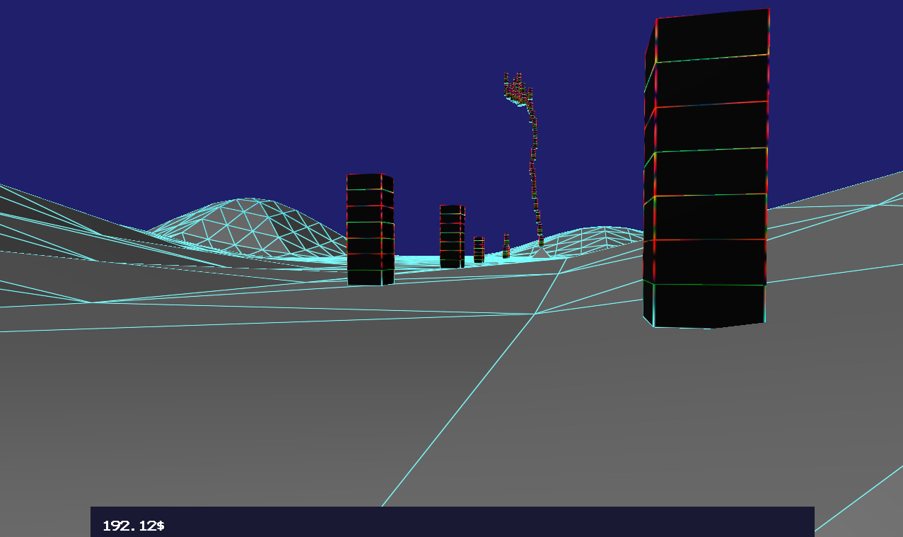

##xFlip  --  a game engine

**libraries used:**
* OpenGL / WebGL
* Bullet Physics
* OpenAL
* YakNet
* SOIL / stb_image
* Freetype-gl (binary requires license notice)
* Emscripten
* X11 / Xi
* QuartzCore(CoreVideo)
* GLEW
* TinyXML2(for tiled map files)
* Android NDK

